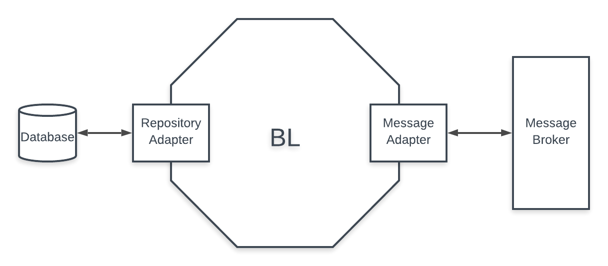
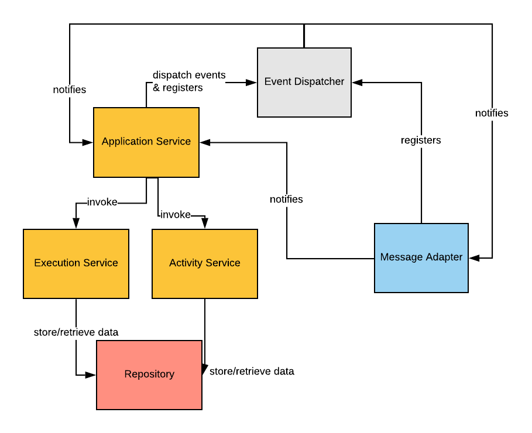

# Adaptive Systems Microservices
## 
Adaptive systems by design are a way of designing and thinking about application which enables a flexible and evolving behavior, defined at runtime.

The design and the functioning of the application is meant to allow a runtime adaptation to the available services. This means that the system can evolve and embrace and exploit new services once they are developed and deployed into the platform.

A practical example of this kind of application is ATLAS (ATLAS-Personalized-Travel-Assistant), which can be found [here](https://github.com/das-fbk/ATLAS-Personalized-Travel-Assistant).

## Purpose
The goal of this project is to map this kind of system into a distributed and microservices architecure.

By doing this, the new architecture can provide, among others:

* Loose coupling of services
* Scalability of services
* Extensibility of the system

## Single Domain Object Microservice

### Architectural overview



The single Domain Object interacts with the external world using async communication and thanks to a Message Adapter which sends and receive messages from the broker.

The architecture is hexagonal, with a Repository Adapter for accessing the database.

### Internal structure


The main components of the microservice are:

* **Services**: contain the Business Logic
* **Event Dispatcher**: dispatch events within the application to the registered handlers
* **Message Adapter**: receives and notifies the BL of messages. It also registeres to the the Event Dispatcher to be notified on Domain Event to be published on the broker
* **Repository**: manages the access to the persistance layer

### Messages
Asynchronous communication is used to communicate with other Domain Objects Microservices (External). It is also used to internally (Internal, in the table) handle various operations. This allows both to spread the workload on more instances of the Domain Object and to handle activity execution consistently, whether they are locally executed or by another DO as part of a **strong dependency**.

| Message | Internal | External | Internal Purpose | External Purpose |
| :- | :-: | :-: | :- | :- | :- |

| id | name | email | bal | 
| -: | - | - | -: | 
| 5 | chris | foo | 12089 |


### Status of the work
The current status of the work allows a DO (DO1) to instantiate a DOI with a standard Activity Plan with the following activities:
```
[0] -> [1] -> (2) -> [3]
```
The activities in `[]` are locally executed, whereas the one in `()` is executed by another DO (**strong dependency**).

The DO uses internal messaging and event dispatching to execute the plan and update the DOI until it meets `(2)`.

At that point it emits a *ExecuteActivityPlan* to the desired DO (DO2) which will instantiate a DOI with the Activity Plan:
```
(2)
```
DO2 will replay with a StrongDependency message and DO1 will process the ActivityExecuted messages from the DOI of DO2. Once `(2)` is executed, DO1 will move on to execute 
`[3]` and then stop.